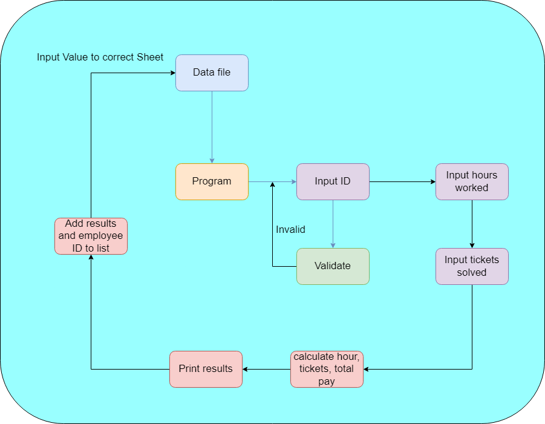
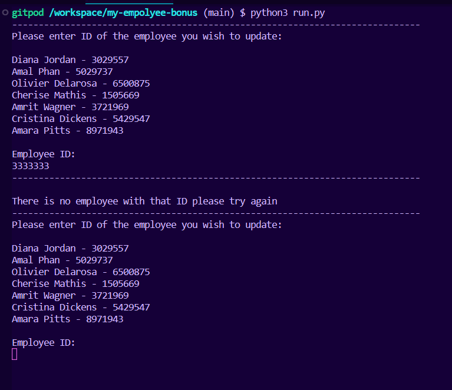
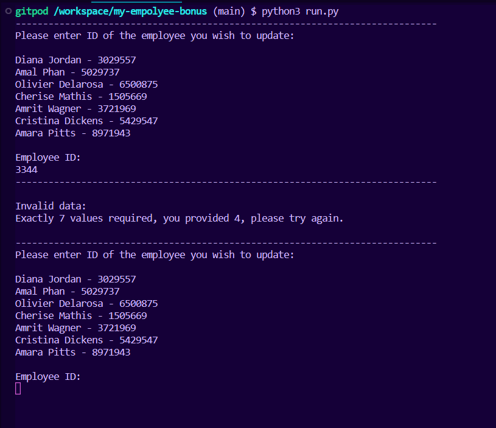
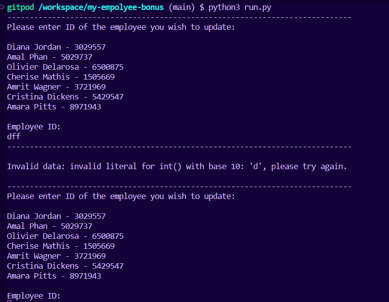
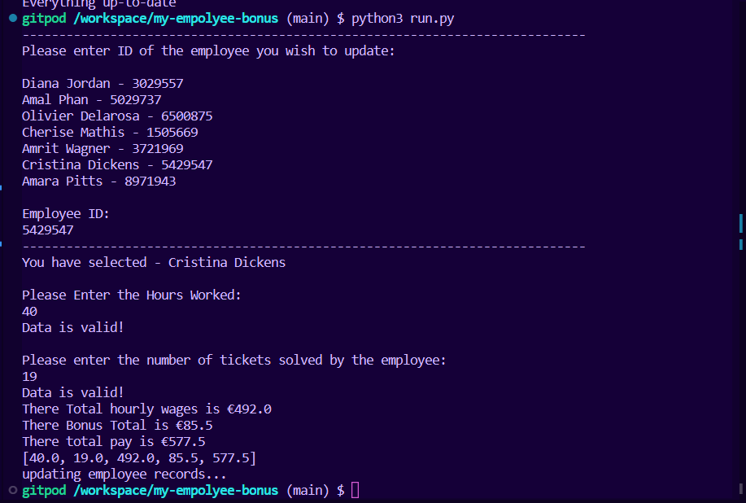
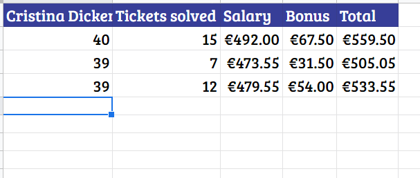
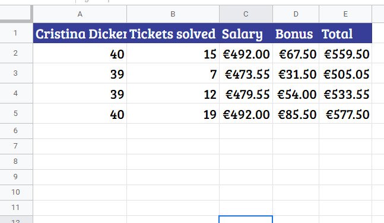

# **Employee Salary and Bonus datafile**
## **Portfolio Project 3**

### **Python  Essentials**
### Diploma in Software Development (E-commerce Applications)  
### **Link to live site - https://github.com/lew94/my-empolyee-bonus**
 

## **Aim**

In this project, you'll build a command-line application that allows your users to manage a common dataset about a particular domain.

**Potential features to include:**

- Allow the user to update record
- User data inputted to calculate results
- write to Google Sheets csv file with values
- update record without removing previous

**Main Technologies**
Required: Python, 

 

# Employee Salary and Bonus datafile
 

## **Initial Steps**
---

 

## Brainstorm:

My flow chart for how I want the program to run, I want the Google sheets file linked to teh program, so using Google Sheets API and gspread I am able to link them and update the sheets file as I please. the user will be promoted to enter data, Which will be validated. If and error the user will be told why and try again. Once successful the program will calculate the rest of the values, Print the results then add the to the correct employee Google sheet with the employee ID.

 

## **Instructions**
---
 

The user runs the program
- The program list all employees and their work ID's
- It will prompt the user to enter employee ID
- It will then validate the information for anything incorrect from the dict of id keys and employee values
- If incorrect data the user will be told why and given another chance to input ID till successful
- Employee name will be printed

Once employee is found :

 - User will be prompted to enter the hours that employee worked
 - data will be validated for int or float values
 - User will be prompted to end the number of tickets the employee solved
 - Date is check and again validated

Once all details are inputted to the system the calculation will take over 
- The hours work will be times by €12.30 and the value stored and printed
- The bonus will be times by €4.50 and the value stored and printed
- Then finally the total hours worked and total bonus will be added together and the value stored and printed
- finally the values will be appended to list and that list will be printed

Finally the system will take the employee ID and search for the correct Google sheets file and append the date to the end of the file.

 

## *Testing and validating**

So for the site to be successful the app I would need to run but most important It must validate the results and write the information to the correct sheet and cell. Below are images of the tests ran on the site.

*Test 1 Enter no letter and the correct amount of numbers:*

## *Test 2 Input incorrect number of digits for ID:*

## *Test 3 Input letters for ID:*

## *Test 4 Input all correct data:*

## *Before and after of Successful result on Google Sheets*

 

## Problems/ Bugs:

Still more validation on the project could take place, while it works right now I want to update later to include dates and limits to the calculations and validations.
Current deployment on heroku is causing a gspread issue which doesn't seem to be fixed.

 

## **Resources**
---
I would like to credit all the site that I used in the building of this site.

## IDE and Hosting sites:

**Visual Studio Web -** https://code.visualstudio.com/docs/editor/vscode-web

**Github -** https://github.com/

**Gitpod -** https://www.gitpod.io/

**Github Pages -** https://pages.github.com/

**Heroku - ** https://www.heroku.com/
 

## **Acknowledgements**
---
 

I just want to use this space to acknowledge all those that helped me to complete this site and this assignment.

I want to thank all those at Code Institute all the facilitators and mentors that helped answer my questions
and provided constructive feedback. I wouldn't be able to complete this project without there help.

I also want to thank all those on the slack chatroom that help point me in the right direction or help provided answers to my question's.

A few sites that I want to acknowledge for all there advice, help and all-around knowledge:

**Stack Overflow -** https://stackoverflow.com/

**Bootstrap -** https://getbootstrap.com/

**W3schools -** https://www.w3schools.com/

**Code Institute -** https://codeinstitute.net/ie/

Without all these resources I would not be able to complete my task and have it look so good, So a special thank you to all those involved.